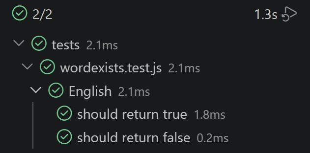

# p5-digital-academy-ejercicios-javascript-simone

1. [Word exists or not](#word-exists-or-not)
2. [Reversing words](#reversing-words)

## Word exists or not

**Objetivo:** 

Dada una cadena de texto (string) de longitud arbitraria que contiene cualquier carácter ASCII, escribir una función para determinar si dicha cadena contiene la palabra completa "English".

**Condiciones:**

1. El orden de los caracteres es importante: una cadena como "abcEnglishdef" es correcta, pero "abcnEglishsef" no lo es.

2. No importa si son mayúsculas o minúsculas: "eNglisH" también se considera correcto (insensible a mayúsculas).

3. Valor de retorno: Devuelve un valor booleano: true si la cadena contiene "English" y false en caso contrario.

**Algoritmo:**

```javascript
export function english(texto) {
    let text = texto.toLowerCase();
    return text.includes("english");
}
```

- export function english(texto)

Creamos la función y utilizamos export para poder realizar nuestros tests.

- let text = texto.toLowerCase

Dentro de la función creamos una nueva variable y utilizamos el método ".toLowerCase" para devolver el valor de la cadena en minúsculas . Así obtenemos el resultado independientemente de cómo esté escrita la palabra.

- return text.includes("english")

Este método determina si la variable establecida "text" incluye un determinado elemento, en este caso la palabra que buscamos ("english"), y devuelve true o false según corresponda.

**Tests:**



## Reversing words

**Objetivo:**

**Condiciones:**

**Algoritmo:**

```javascript

```

**Tests:**