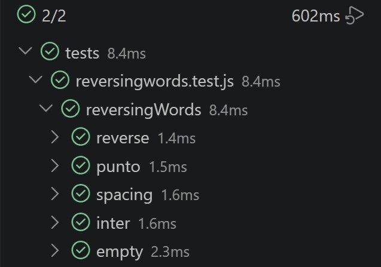

# p5-digital-academy-ejercicios-javascript-simone

1. [Word exists or not](#word-exists-or-not)
2. [Reversing words](#reversing-words)
3. [Counting sheep](#counting-sheep)

## Word exists or not

**Objetivo:** 

Dada una cadena de texto (string) de longitud arbitraria que contiene cualquier carácter ASCII, escribir una función para determinar si dicha cadena contiene la palabra completa "English".

**Condiciones:**

1. El orden de los caracteres es importante: una cadena como "abcEnglishdef" es correcta, pero "abcnEglishsef" no lo es.

2. No importa si son mayúsculas o minúsculas: "eNglisH" también se considera correcto (insensible a mayúsculas).

3. Valor de retorno: Devuelve un valor booleano: true si la cadena contiene "English" y false en caso contrario.

**Algoritmo:**

```javascript
export function english(texto) {
    let text = texto.toLowerCase();
    return text.includes("english");
}
```

- export function english(texto)

Creamos la función y utilizamos export para poder realizar nuestros tests.

- let text = texto.toLowerCase

Dentro de la función creamos una nueva variable y utilizamos el método ".toLowerCase" para devolver el valor de la cadena en minúsculas . Así obtenemos el resultado independientemente de cómo esté escrita la palabra.

- return text.includes("english")

Este método determina si la variable establecida "text" incluye un determinado elemento, en este caso la palabra que buscamos ("english"), y devuelve true o false según corresponda.

**Tests:**


## Reversing words

**Objetivo:**

Escribir una función que invierta el orden de las palabras en una cadena de texto (*string*) proporcionada. 

**Condiciones:**

1. El orden de las palabras debe invertirse (la última palabra pasa a ser la primera, etc.).

2. Se deben ignorar los espacios en blanco adicionales al principio y al final de la cadena (trailing/leading spaces).

3. Si hay más de un espacio entre palabras, el resultado final solo debe tener un único espacio separándolas.

4. Una cadena vacía o que solo contiene espacios debe devolver una cadena vacía.

**Algoritmo:**

```javascript
export function reversingWords(str) {
  const limpio = str.trim().replace(/\s+/g, ' ');
  if (!limpio) return '';
  return limpio.split(' ').reverse().join(' ');
}
```

- trim() 

Elimina los espacios leading y trailing:

"  hola mundo  ".trim() // "hola mundo"

- replace(/\s+/g, ' ')

Colapsa múltiples espacios consecutivos en uno solo. "\s" representa cualquier carácter de espacio en blanco, "+" significa "uno o más" del carácter anterior. Juntos, "\s+" captura cualquier secuencia de uno o más espacios en blanco consecutivos. Finalmente, "g" (Flag global), sustituye todas las coincidencias en lugar de solo la primera como haría replace normalmente:

"hola   mundo".replace(/\s+/g, ' ') // "hola mundo"

- if (!limpio) return ''

Si tras la limpieza el string es "" (vacío o solo espacios), retorna "".

- return limpio.split(' ') 

Separa el string en un array de palabras:

"hola mundo".split(' ') // ['hola', 'mundo']

- .reverse() 

Invierte el orden de las palabras, manteniendo intacta la puntuación:

['hola', 'mundo'].reverse() // ['mundo', 'hola']

- .join(' ') 

Une las palabras con un único espacio entre ellas:

['mundo', 'hola'].join(' ') // "mundo hola"

**Tests:**



## Counting sheep

**Objetivo**

Escribir una function que nos diga cuantas ovejas hay en total o si los lobos se han comido las ovejas

**Condiciones**

1. Scenario: Solo hay ovejas

    Given que proporciono una lista válida que contiene únicamente valores true
    When ejecuto la función countAnimals
    Then el resultado debe ser "There are <quantity> sheep in total"

2. Scenario: Solo hay lobos
    Given que proporciono una lista válida que contiene únicamente valores false
    When ejecuto la función countAnimals
    Then el resultado debe ser "UPS!!! A pack of hungry wolves"

3. Scenario: Hay más ovejas que lobos
    Given que proporciono una lista válida de valores booleanos
    And la cantidad de true es mayor que la cantidad de false
    When ejecuto la función countAnimals
    Then el resultado debe ser "<quantity> sheep escaped!!!"

4. Scenario: Hay más lobos que ovejas
    Given que proporciono una lista válida de valores booleanos
    And la cantidad de false es mayor que la cantidad de true
    When ejecuto la función countAnimals
    Then el resultado debe ser "UPS!!! Wolves ate all the sheep"

5. Scenario: El input no es un array
    Given que proporciono un valor que no es un array
    When ejecuto la función countAnimals
    Then debe lanzarse un error con el mensaje "Invalid input: list must contain only boolean values"

6. Scenario: El array contiene elementos que no son booleanos
    Given que proporciono un array con valores no booleanos
    When ejecuto la función countAnimals
    Then debe lanzarse un error con el mensaje "Invalid input: list must contain only boolean values"

**Algoritmo**

```javascript

```

**Tests**